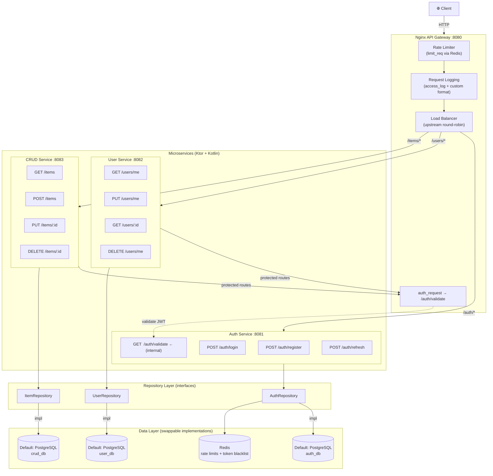

# Microservices Starter Kit

A production-oriented microservices template built with **Ktor/Kotlin** and **Nginx**. Database-agnostic by design - ships with PostgreSQL and Redis as defaults, but any data store can be swapped in per-service via the repository pattern. Designed as a reusable foundation for building scalable backend systems with minimal boilerplate.

## Table of Contents

- [Architecture Overview](#architecture-overview)
- [Tech Stack](#tech-stack)
- [Project Structure](#project-structure)
- [Services](#services)
  - [API Gateway (Nginx)](#api-gateway-nginx)
  - [Auth Service](#auth-service)
  - [User Service](#user-service)
  - [CRUD Service](#crud-service)
- [Data Layer](#data-layer)
  - [Repository Pattern](#repository-pattern)
  - [Default Configuration](#default-configuration)
  - [Redis](#redis)
  - [Migrations](#migrations)
  - [Swapping a Database](#swapping-a-database)
- [API Reference](#api-reference)
- [Getting Started](#getting-started)
  - [Prerequisites](#prerequisites)
  - [Environment Variables](#environment-variables)
  - [Running the Stack](#running-the-stack)
- [Extending the Kit](#extending-the-kit)
  - [Adding a New Service](#adding-a-new-service)
  - [Using a Different Database](#using-a-different-database)
- [License](#license)

---

## Architecture Overview



All incoming traffic is routed through the Nginx gateway, which handles rate limiting, request logging, and load balancing. Protected routes are validated via Nginx's `auth_request` directive, which issues an internal subrequest to the Auth Service before forwarding traffic downstream.

Each service accesses its data through repository interfaces, with PostgreSQL as the default implementation. The database behind any service can be swapped by providing a new repository implementation - no changes to routes or business logic required. Each service owns its database. There are no shared schemas between services.

## Tech Stack

| Component       | Technology                              |
|-----------------|-----------------------------------------|
| API Gateway     | Nginx                                   |
| Microservices   | Ktor (Kotlin)                           |
| Data Access     | Repository pattern (interface-driven)   |
| Default DB      | PostgreSQL (swappable per-service)      |
| Caching / State | Redis                                   |
| Auth            | JWT (HMAC-SHA256)                       |
| Default ORM     | Exposed (JetBrains)                     |
| Containerization| Docker + Docker Compose                 |

## Project Structure

```
microservices-starter-kit/
├── docker-compose.yml
├── .env.example
├── nginx/
│   └── nginx.conf
├── services/
│   ├── auth-service/
│   │   ├── Dockerfile
│   │   ├── build.gradle.kts
│   │   └── src/main/
│   │       ├── kotlin/com/starter/auth/
│   │       │   ├── Application.kt
│   │       │   ├── config/
│   │       │   │   └── DatabaseConfig.kt
│   │       │   ├── models/
│   │       │   │   ├── User.kt
│   │       │   │   └── DTOs.kt
│   │       │   ├── repository/
│   │       │   │   ├── AuthRepository.kt          ← interface
│   │       │   │   └── PostgresAuthRepository.kt  ← default impl
│   │       │   ├── routes/
│   │       │   │   └── AuthRoutes.kt
│   │       │   └── services/
│   │       │       ├── AuthService.kt
│   │       │       └── TokenService.kt
│   │       └── resources/
│   │           └── application.conf
│   ├── user-service/
│   │   ├── Dockerfile
│   │   ├── build.gradle.kts
│   │   └── src/main/
│   │       ├── kotlin/com/starter/user/
│   │       │   ├── Application.kt
│   │       │   ├── config/
│   │       │   ├── models/
│   │       │   ├── repository/
│   │       │   │   ├── UserRepository.kt          ← interface
│   │       │   │   └── PostgresUserRepository.kt  ← default impl
│   │       │   └── routes/
│   │       └── resources/
│   │           └── application.conf
│   └── crud-service/
│       ├── Dockerfile
│       ├── build.gradle.kts
│       └── src/main/
│           ├── kotlin/com/starter/crud/
│           │   ├── Application.kt
│           │   ├── config/
│           │   ├── models/
│           │   ├── repository/
│           │   │   ├── ItemRepository.kt          ← interface
│           │   │   └── PostgresItemRepository.kt  ← default impl
│           │   └── routes/
│           └── resources/
│               └── application.conf
└── scripts/
    └── init-databases.sh
```

## Services

### API Gateway (Nginx)

The gateway is the single entry point for all client traffic on port `8080`. It provides four core functions:

**Rate Limiting** - Configured via `limit_req_zone`, backed by Redis. Limits are applied per client IP. Default thresholds are set to 30 requests/second with a burst tolerance of 50. These values are configurable in `nginx.conf`.

**JWT Validation** - Protected routes trigger an internal `auth_request` subrequest to `GET /auth/validate` on the Auth Service. The Auth Service inspects the `Authorization` header and returns `200` (valid) or `401` (invalid/expired). Nginx blocks the request if validation fails. Public routes (`/auth/register`, `/auth/login`) bypass this check.

**Load Balancing** - Each service is defined as an `upstream` block using round-robin distribution. To scale a service horizontally, add additional instances to the corresponding upstream block and to `docker-compose.yml`.

**Request Logging** - All requests are logged in a structured format including timestamp, client IP, method, path, status code, response time, and upstream address. Logs are written to stdout for easy aggregation with external tooling.

### Auth Service

Port: `8081`
Database: `auth_db`

Handles user registration, authentication, and token lifecycle. Passwords are hashed using bcrypt. JWTs are issued as access/refresh token pairs. Revoked tokens are stored in Redis with a TTL matching the token's remaining lifetime.

The `/auth/validate` endpoint is internal-only, called exclusively by Nginx's `auth_request`. It decodes the JWT, checks the blacklist, and returns the user ID in a response header (`X-User-Id`) which Nginx forwards to downstream services.

### User Service

Port: `8082`
Database: `user_db`

Manages user profile data. All routes are protected. The authenticated user's ID is extracted from the `X-User-Id` header injected by the gateway after successful JWT validation.

### CRUD Service

Port: `8083`
Database: `crud_db`

A generic resource service operating on an `items` entity. Intended as a template - duplicate this service and rename the entity to add new bounded contexts to the system. All routes are protected.

## Data Layer

### Repository Pattern

Each service accesses its data through repository interfaces. Routes and business logic depend only on the interface - never on a specific database client or ORM. This means you can swap PostgreSQL for MongoDB, MySQL, DynamoDB, or any other store by writing a new implementation class and updating the DI configuration. No changes to routes or service logic required.

Example structure for the CRUD service:

```
ItemRepository (interface)
├── PostgresItemRepository   ← ships as default
├── MongoItemRepository      ← you add this if needed
└── InMemoryItemRepository   ← useful for testing
```

### Default Configuration

The template ships with PostgreSQL so the stack runs out of the box. Each service connects to its own database instance, enforcing the database-per-service pattern for loose coupling and independent schema evolution.

| Service       | Default DB    | Purpose                        |
|---------------|---------------|--------------------------------|
| Auth Service  | PostgreSQL `auth_db` | Credentials, token metadata    |
| User Service  | PostgreSQL `user_db` | Profile data                   |
| CRUD Service  | PostgreSQL `crud_db` | Generic items (template)       |

### Redis

Redis is shared across the stack and serves two purposes:

1. **Rate limiting state** - Nginx tracks request counts per IP.
2. **Token blacklist** - The Auth Service writes revoked JWTs here with an expiry TTL.

### Migrations

Schema migrations are handled via Exposed's `SchemaUtils.create()` on application startup. For production use, consider replacing this with a dedicated migration tool such as Flyway or Liquibase.

### Swapping a Database

To replace the database for any service:

1. Add the new database driver/client dependency to the service's `build.gradle.kts`.
2. Create a new repository implementation (e.g., `MongoItemRepository`) that implements the existing interface.
3. Update the DI module to bind the interface to your new implementation.
4. Replace the PostgreSQL container in `docker-compose.yml` with your target database.
5. Update environment variables in `.env` accordingly.

## API Reference

### Auth Service

| Method | Endpoint         | Auth     | Description                          |
|--------|------------------|----------|--------------------------------------|
| POST   | `/auth/register` | Public   | Register a new user                  |
| POST   | `/auth/login`    | Public   | Authenticate and receive token pair  |
| POST   | `/auth/refresh`  | Public   | Exchange refresh token for new pair  |
| GET    | `/auth/validate` | Internal | Validate JWT (called by Nginx only)  |

**POST /auth/register**
```json
// Request
{
  "email": "user@example.com",
  "password": "securepassword"
}

// Response 201
{
  "id": "uuid",
  "email": "user@example.com",
  "createdAt": "2025-01-01T00:00:00Z"
}
```

**POST /auth/login**
```json
// Request
{
  "email": "user@example.com",
  "password": "securepassword"
}

// Response 200
{
  "accessToken": "eyJhbGci...",
  "refreshToken": "eyJhbGci...",
  "expiresIn": 3600
}
```

**POST /auth/refresh**
```json
// Request
{
  "refreshToken": "eyJhbGci..."
}

// Response 200
{
  "accessToken": "eyJhbGci...",
  "refreshToken": "eyJhbGci...",
  "expiresIn": 3600
}
```

### User Service

All endpoints require `Authorization: Bearer <token>`.

| Method | Endpoint     | Description               |
|--------|------------- |---------------------------|
| GET    | `/users/me`  | Get authenticated profile |
| PUT    | `/users/me`  | Update profile            |
| GET    | `/users/:id` | Get user by ID            |
| DELETE | `/users/me`  | Delete account            |

**GET /users/me**
```json
// Response 200
{
  "id": "uuid",
  "email": "user@example.com",
  "displayName": "Yassine",
  "bio": null,
  "createdAt": "2025-01-01T00:00:00Z",
  "updatedAt": "2025-01-15T12:00:00Z"
}
```

**PUT /users/me**
```json
// Request
{
  "displayName": "Yassine",
  "bio": "Software engineer"
}

// Response 200
{ ... updated profile ... }
```

### CRUD Service

All endpoints require `Authorization: Bearer <token>`.

| Method | Endpoint      | Description          |
|--------|---------------|----------------------|
| GET    | `/items`      | List items (paginated) |
| POST   | `/items`      | Create item          |
| GET    | `/items/:id`  | Get item by ID       |
| PUT    | `/items/:id`  | Update item          |
| DELETE | `/items/:id`  | Delete item          |

**GET /items**
```
GET /items?page=1&size=20
```
```json
// Response 200
{
  "data": [
    {
      "id": "uuid",
      "name": "Sample Item",
      "description": "A template entity",
      "ownerId": "uuid",
      "createdAt": "2025-01-01T00:00:00Z",
      "updatedAt": "2025-01-01T00:00:00Z"
    }
  ],
  "page": 1,
  "size": 20,
  "totalPages": 1,
  "totalItems": 1
}
```

**POST /items**
```json
// Request
{
  "name": "New Item",
  "description": "Description here"
}

// Response 201
{
  "id": "uuid",
  "name": "New Item",
  "description": "Description here",
  "ownerId": "uuid",
  "createdAt": "2025-01-01T00:00:00Z",
  "updatedAt": "2025-01-01T00:00:00Z"
}
```

## Getting Started

### Prerequisites

- Docker Engine 24+
- Docker Compose v2+

### Environment Variables

Copy the example file and adjust values as needed:

```bash
cp .env.example .env
```

| Variable            | Default                  | Description                     |
|---------------------|--------------------------|---------------------------------|
| `GATEWAY_PORT`      | `8080`                   | Host port for the Nginx gateway |
| `DB_USER`           | `postgres`               | PostgreSQL username             |
| `DB_PASSWORD`       | `postgres`               | PostgreSQL password             |
| `AUTH_DB`           | `auth_db`                | Auth service database name      |
| `USER_DB`           | `user_db`                | User service database name      |
| `CRUD_DB`           | `crud_db`                | CRUD service database name      |
| `JWT_SECRET`        | `change-me-in-production`| HMAC-SHA256 signing key         |
| `JWT_ISSUER`        | `microservices-starter`  | JWT issuer claim                |
| `JWT_EXPIRATION_MS` | `3600000`                | Access token TTL (ms)           |
| `REDIS_HOST`        | `redis`                  | Redis hostname                  |
| `REDIS_PORT`        | `6379`                   | Redis port                      |

### Running the Stack

```bash
# Clone the repository
git clone https://github.com/your-username/microservices-starter-kit.git
cd microservices-starter-kit

# Copy and configure environment
cp .env.example .env

# Start all services
docker compose up -d

# Verify everything is running
docker compose ps

# View gateway logs
docker compose logs -f nginx
```

The API is available at `http://localhost:8080`.

### Health Check

```bash
curl http://localhost:8080/auth/health
# Expected: {"status": "ok"}
```

## Extending the Kit

### Adding a New Service

1. Duplicate the `services/crud-service` directory and rename it.
2. Update the package namespace in the Kotlin source files.
3. Rename the entity (replace `items` with your resource name).
4. Define your repository interface and provide an implementation.
5. Add the new service to `docker-compose.yml` with its own database instance.
6. Add a new `upstream` block and `location` route in `nginx/nginx.conf`.
7. If the routes require authentication, include the `auth_request` directive in the location block.

### Using a Different Database

See [Swapping a Database](#swapping-a-database) in the Data Layer section. Each service is independent - you can run PostgreSQL for auth, MongoDB for the CRUD service, and MySQL for users simultaneously.

## License

MIT
